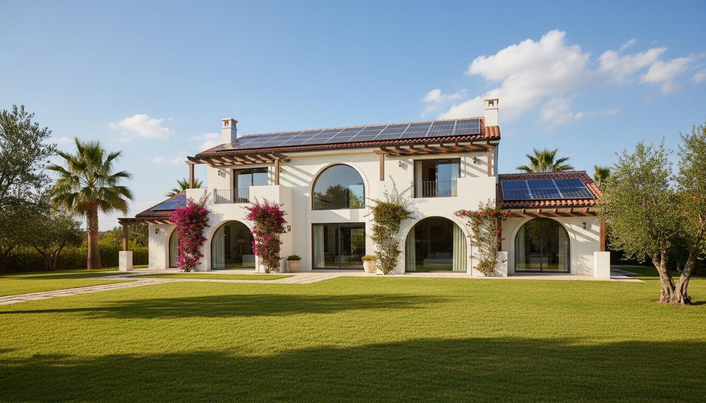

# GESPA Solar Energy Website

Modern, responsive solar energy company website built with React, TypeScript, Tailwind CSS, and Framer Motion.



## Features

- **Modern Design**: Clean, eco-friendly aesthetic with smooth animations
- **Responsive**: Fully responsive design for all devices
- **Animations**: Smooth scroll-triggered animations with Framer Motion
- **Sections**:
  - Hero with call-to-action
  - Features/Advantages
  - About Us with statistics
  - Products showcase
  - Projects portfolio
  - Statistics counter
  - FAQ accordion
  - Contact CTA
  - Footer

## Tech Stack

- **Framework**: React + TypeScript + Vite
- **Styling**: Tailwind CSS
- **UI Components**: shadcn/ui
- **Animations**: Framer Motion
- **Icons**: Lucide React

## Getting Started

### Prerequisites

- Node.js 20+
- npm or yarn

### Installation

1. Clone the repository:
```bash
git clone https://github.com/yourusername/gespa-solar-website.git
cd gespa-solar-website
```

2. Install dependencies:
```bash
npm install
```

3. Run development server:
```bash
npm run dev
```

4. Open [http://localhost:5173](http://localhost:5173) in your browser.

## Build

To create a production build:

```bash
npm run build
```

The build output will be in the `dist` folder.

---

## 🚀 Deploy to Railway (Recommended)

Railway, modern bulut platformudur ve otomatik deploy sağlar.

### Adım 1: GitHub'a Push Et

```bash
cd /mnt/okcomputer/output/app
git init
git add .
git commit -m "Initial commit"
git branch -M main
git remote add origin https://github.com/KULLANICI_ADINIZ/gespa-solar-website.git
git push -u origin main
```

### Adım 2: Railway'de Deploy Et

**Seçenek A: Railway Dashboard (Kolay)**

1. [Railway](https://railway.com)'e git ve hesap oluştur
2. "New Project" → "Deploy from GitHub repo"
3. GitHub hesabını bağla ve repo'yu seç
4. Railway otomatik olarak build edip deploy edecek
5. Site URL'sini Dashboard'dan görüntüleyebilirsin

**Seçenek B: Railway CLI**

```bash
# Railway CLI kur
npm install -g @railway/cli

# Login
railway login

# Projeye bağlan
railway link

# Deploy
railway up
```

### Railway Ortam Değişkenleri (Opsiyonel)

Railway Dashboard → Variables bölümünden ekleyebilirsin:

| Variable | Değer | Açıklama |
|----------|-------|----------|
| `NODE_ENV` | `production` | Production modu |
| `PORT` | `3000` | Port numarası (otomatik) |

---

## 🌐 Deploy to GitHub Pages

### Method 1: Using GitHub Actions (Recommended)

1. Push your code to GitHub:
```bash
git init
git add .
git commit -m "Initial commit"
git branch -M main
git remote add origin https://github.com/yourusername/gespa-solar-website.git
git push -u origin main
```

2. Go to your repository on GitHub
3. Navigate to **Settings** > **Pages**
4. Under "Source", select "GitHub Actions"
5. The workflow will automatically deploy your site on every push to main

### Method 2: Using gh-pages package

1. Update `vite.config.ts` with your repository name:
```typescript
base: '/your-repo-name/',
```

2. Deploy:
```bash
npm run deploy
```

3. Go to repository Settings > Pages and set source to "Deploy from a branch" > "gh-pages"

---

## Project Structure

```
├── src/
│   ├── components/ui/     # shadcn/ui components
│   ├── hooks/             # Custom React hooks
│   ├── sections/          # Page sections
│   ├── App.tsx           # Main app component
│   └── index.css         # Global styles
├── public/
│   └── images/           # Static images
├── .github/workflows/    # GitHub Actions
├── railway.json          # Railway config
├── dist/                 # Build output
└── package.json
```

## Customization

### Colors

Edit `tailwind.config.js` to customize colors:

```javascript
colors: {
  brand: {
    green: "#1a5f2a",
    "green-light": "#2d8a4e",
    orange: "#f4a020",
    "orange-dark": "#e8941f",
  },
}
```

### Content

Edit section files in `src/sections/` to update content.

## License

MIT License - feel free to use this template for your projects.

## Credits

- Design inspired by GESPA Enerji
- Images generated with AI
- Icons by Lucide
